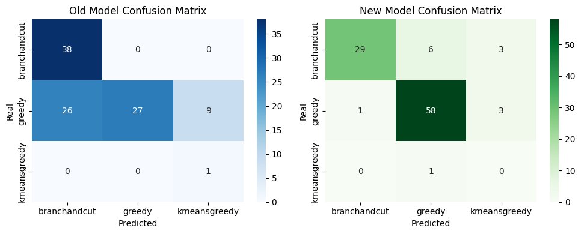
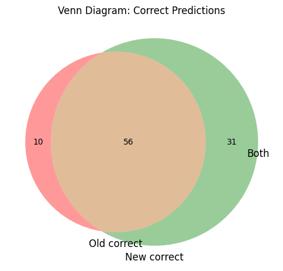

# State-of-the-art in Automated Algorithm Selection for Multiple TSP

## 1. **Introduction**
The Multiple Traveling Salesman Problem (mTSP) is a generalization of the classic Traveling Salesman Problem (TSP), where multiple salesmen must collectively visit a set of cities while minimizing the total travel cost. This problem has various applications in logistics, transportation, and robotics. Given the complexity and variability of instances, automated algorithm selection can significantly improve solution efficiency by identifying the most suitable algorithm for a given instance. The chosen approach is for the standard mTSP where all the salesman return to the depot and need to visit at least one city.

---

## 2. **Existing Approaches**

### 2.1 **Deterministic Approaches**
- **Branch-and-Bound (B&B)**: Exhaustively explores the solution space while pruning suboptimal branches.
- **Dynamic Programming (DP)**: Solves subproblems recursively but suffers from exponential time complexity.
- **Branch & Cut**: Uses the Branch & Bound search strategy combined with cutting planes to reduce the search space.

### 2.2 **Heuristic Approaches**
- **Greedy Algorithms** : Iteratively selects the locally optimal choice (ex. nearest neighbor heuristic).
- **Minimum Spanning Tree (MST)- Based Methods**: These methods construct an MST and convert it into a feasible tour.

### 2.3 **Metaheuristic Approaches**
- **Genetic Algorithms (GA)**: Uses evolutionary strategies to explore the solution space.
- **Ant Colony Optimization (ACO)**: Mimics the foraging behavior of ants to find high-quality solutions.
- **Particle Swarm Optimization (PSO)**: Optimizes through the collaboration of particles representing potential solutions.
- **Simulated Annealing (SA)**: Mimics the annealing process in metallurgy to escape local optima.
- **Tabu Search (TS)**: Uses memory structures to guide the search away from previously explored solutions.

### 2.4 **Hybrid and Machine Learning Approaches**
- **Hybrid Heuristics**: Combines multiple heuristics/metaheuristics for better performance.
- **Hyperheuristics**: A higher-level methodology that selects or generates heuristics adaptively.
- **Anytime Algorithm Selection**: Dynamically switches algorithms based on instance characteristics.
- **AutoML-Based Selection**: Uses Machine Learning techniques to predict the best-performing algorithm.

### 2.5 **Chosen Approaches**

The following approaches were implemented to solve the Multiple Traveling Salesman Problem (mTSP):

### 1. **Greedy - Shortest Route**
   - **Description**: A simple heuristic that assigns cities to salesmen by iteratively selecting the nearest unvisited city. Each salesman starts and ends at the depot.
   - **Implementation**: 
     - Ensures each salesman visits at least one city.
     - Minimizes the total distance traveled by all salesmen.

### 2. **KMeans Greedy**
   - **Description**: Combines clustering and greedy heuristics. Cities are grouped into clusters using KMeans, and each cluster is assigned to a salesman. A greedy approach is then used to solve each cluster.
   - **Implementation**:
     - Uses KMeans clustering to divide cities into compact groups.
     - Redistributes cities to avoid empty clusters.
     - Solves each cluster using a greedy algorithm.

### 3. **Ant Colony Optimization (ACO)**
   - **Description**: A metaheuristic inspired by the foraging behavior of ants. It uses pheromone trails and heuristic information to iteratively improve solutions.
   - **Implementation**:
     - Balances exploration and exploitation to find high-quality solutions.
     - Includes mechanisms to handle stagnation and a time limit of 100 seconds.
     - Updates pheromone trails based on solution quality.

### 4. **Branch and Cut**
   - **Description**: An exact method that combines Branch and Bound with cutting planes to reduce the search space and solve the problem optimally within a time limit.
   - **Implementation**:
     - Uses linear programming to model the problem.
     - Includes constraints to eliminate subtours and enforce valid routes.
     - Solves the problem using the OR-Tools CBC/GUROBI solver with a 100-second time limit.

### **Evaluation Metrics**
Each approach is evaluated based on the following metrics:
- **Total Cost**: The total distance traveled by all salesmen.
- **Normalized Cost**: The total cost of the solution normalized relative to the best-known solution for the same instance.
- **Time Taken**: The time required to compute the solution.
- **Distance Gap**: The difference between the longest and shortest routes among salesmen.
- **Efficiency**: A metric combining cost and time to evaluate performance.

These approaches provide a mix of heuristic, metaheuristic, and exact methods to address the diverse requirements of mTSP instances.

---

## 3. **Benchmark Instances**
Several benchmark datasets are used to evaluate algorithm performance on mTSP:
- **TSPLIB**: A standard collection of TSP instances.
- **CVRPLIB**: Focuses on capacitated vehicle routing problems.
- **DIMACS TSP Challenge**: Provides large-scale TSP and VRP instances.
- **Randomly Generated Instances**: Used for controlled testing and ML training.

I chose to randomly generate my instances, because the lack of mTSP benchmark datasets due to the focus being on TSP problems and many such popular benchmarks do bot cover mTSP.

---


## 4. **Algorithm Selection using Machine Learning**

### 4.1 **Feature Selection**
Key attributes influencing algorithm performance include:
- **Number of cities and salesmen**: The size of the problem directly impacts the complexity and the suitability of different algorithms.
- **Distance matrix properties**: Characteristics such as clustering tendency and edge density can influence the performance of algorithms.
- **Graph topology**: Features like connectivity and degree distribution provide insights into the structure of the problem instance.
- **Solution diversity**: The number of feasible solutions within a cost threshold can indicate the difficulty of the problem.

#### **Instance Features Used**
The following features are extracted from the problem instances and stored in the `instances` table:
- `average_distance`: The average distance between cities.
- `stddev_distance`: The standard deviation of distances between cities.
- `density`: The density of the graph representing the instance.
- `salesmen_ratio`: The ratio of salesmen to cities.
- `bounding_box_area`: The area of the bounding box enclosing all cities.
- `aspect_ratio`: The aspect ratio of the bounding box.
- `spread`: The spread of cities in the instance.
- `cluster_compactness`: A measure of how compact the clusters of cities are.
- `mst_total_length`: The total length of the Minimum Spanning Tree (MST) for the instance.
- `entropy_distance_matrix`: The entropy of the distance matrix, representing the diversity of distances.

---

### 4.2 **Dataset Construction**
- Collect performance data for multiple algorithms across diverse instances.
- Encode problem features to form input vectors.
- Label instances with the best-performing algorithm.

---

### 4.3 **Prediction Models**
- **Neural Networks**: Highly suitable for capturing complex, non-linear relationships between instance features and algorithm performance. They can be trained on large datasets to predict the best algorithm for a given instance based on its features.
- **LLMs (Large Language Models)**: Recent advancements in LLMs, such as GPT-based architectures, have introduced new possibilities for algorithm selection.  

  By combining Neural Networks and LLMs, we can build robust predictive models that not only recommend the best algorithm but also provide interpretability and adaptability to diverse problem instances.

---

### 4.4 **Neural Network Model Architecture**

To automatically select the optimal algorithm for each mTSP instance, we implemented a multi-layer neural network trained on instance features.

**Model Architecture:**
- **Input:** Feature vector for each instance (e.g., number of cities, salesmen, density, etc.)
- **Hidden Layers:**  
  - First layer: 64 neurons, ReLU activation, Batch Normalization, Dropout (0.3)  
  - Second layer: 32 neurons, ReLU activation, Dropout (0.3)
- **Output:** Fully-connected layer with Softmax for multi-class classification (one probability per algorithm strategy)
- **Regularization:** Dropout and Batch Normalization to prevent overfitting
- **Class Weights:** Used in the CrossEntropyLoss function to address class imbalance
- **Optimization:** Adam optimizer with weight decay and learning rate scheduler
- **Early Stopping:** Training stops when no improvement is seen on the validation set

**Workflow:**
1. Extract and normalize relevant features for each instance.
2. Train the model on the training data, using class weights for underrepresented strategies.
3. Validate the model on a separate set to prevent overfitting.
4. For prediction, the model outputs probabilities for each strategy, selecting the one with the highest score.

This model enables fast and automatic selection of the most suitable algorithm for any mTSP instance, based on historical data and problem characteristics.

---

### 4.5 **Comparative Analysis: Old vs. New Model**

To evaluate progress in algorithm selection, I compared the performance of the initial ("old") model and the improved ("new") model using the same test instances and metrics.

The new version of the model (version 2) brings several improvements over the initial approach:

- **Advanced Data Balancing:** Underrepresented algorithm classes are augmented using resampling and SMOTE, leading to a more balanced training set and improved generalization.
- **Composite Score Modeling:** Instead of a fixed formula, the composite score is now predicted using a Gradient Boosting Regressor trained on performance metrics, providing a more nuanced evaluation of each algorithm's quality.
- **Improved Feature Normalization:** Feature scaling and normalization are consistently applied to both training and validation data, ensuring stable model performance.
- **Enhanced Neural Network Architecture:** The new model uses a deeper network with batch normalization and LeakyReLU activations, as well as Focal Loss to better handle class imbalance.
- **Regularization and Early Stopping:** Stronger regularization (weight decay, dropout, and cosine annealing learning rate) and a more robust early stopping strategy to help prevent overfitting.

These enhancements result in higher accuracy, better class-wise performance, and improved robustness on diverse mTSP instances.


From the analysis of data I managed to collect and show the following data:

**Key comparison metrics:**
- **Accuracy**: Proportion of correctly predicted best algorithms.
- **Classification Report**: Precision, recall, and F1-score for each algorithm class.
- **Confusion Matrix**: Visualization of prediction errors and improvements.
- **Instance-level Analysis**: Overlap and differences in correctly classified instances.

**Summary of Results:**
- The new model achieved a higher overall accuracy compared to the old model.
- Improvements were observed in the prediction of certain algorithm classes, as shown by the classification report and confusion matrix.
- A Venn diagram was used to visualize the overlap of correctly classified instances between the two models, highlighting areas of improvement.

**Visualization Examples:**
- Heatmaps of confusion matrices for both models.
- Venn diagram showing unique and shared correct predictions.

Confusion Matrix



Venn Diagram



These analyses demonstrate the effectiveness of the improvements made in the new model and provide insights into remaining challenges for specific instance types.

---


### 4.6 **Statistics**

**Summary Table: Old vs. New Model**

| Metric                      | Old Model         | New Model         |
|-----------------------------|------------------|------------------|
| Shape (instances, columns)  | (101, 4)         | (101, 4)         |
| Accuracy                    | 65.35%           | 86.14%           |

**Predicted Algorithm Distribution**

| Algorithm        | Old Model | New Model | Real Best |
|------------------|-----------|-----------|-----------|
| Greedy           | 27        | 65        | 62        |
| Branch and Cut   | 64        | 30        | 38        |
| KMeans-Greedy    | 10        | 6         | 1         |

---

#### **Classification Report**

<details>
<summary>Old model classification report</summary>

```
              precision    recall  f1-score   support

branchandcut       0.59      1.00      0.75        38
      greedy       1.00      0.44      0.61        62
kmeansgreedy       0.10      1.00      0.18         1

    accuracy                           0.65       101
   macro avg       0.56      0.81      0.51       101
weighted avg       0.84      0.65      0.65       101
```
</details>

<details>
<summary>New model classification report</summary>

```
              precision    recall  f1-score   support

branchandcut       0.97      0.76      0.85        38
      greedy       0.89      0.94      0.91        62
kmeansgreedy       0.00      0.00      0.00         1

    accuracy                           0.86       101
   macro avg       0.62      0.57      0.59       101
weighted avg       0.91      0.86      0.88       101
```
</details>

---

#### **Match Rate by Class**

| Algorithm        | Old Model Match Rate | New Model Match Rate |
|------------------|---------------------|---------------------|
| Branch and Cut   | 1.000               | 0.763               |
| Greedy           | 0.435               | 0.935               |
| KMeans-Greedy    | 1.000               | 0.000               |


---

## 5. **Smol Agents and Autonomous Systems for Algorithm Selection**

Recent advancements in lightweight AI agents, such as **Smol Agents**, have introduced new possibilities for automated algorithm selection in mTSP. These agents can assist in various stages of the selection process, including feature extraction, data preprocessing, and recommendation of algorithms based on historical performance.

### **Applications of Smol Agents in Algorithm Selection for mTSP**
- **Feature Engineering**: Smol Agents can assist in identifying and extracting relevant problem characteristics to improve algorithm selection.
- **Automated Code Generation**: These agents can generate and optimize code for solving mTSP instances, including heuristic and metaheuristic approaches.
- **Hyperparameter Optimization**: Smol Agents can suggest hyperparameter tuning strategies for Machine Learning models used in algorithm selection.
- **Explainability & Interpretability**: They can provide insights into why certain algorithms perform better on specific instances.

### **Autonomous Systems for Algorithm Selection**
Autonomous systems leveraging lightweight AI agents could enhance algorithm selection by:
- **Dynamic Algorithm Switching**: Adapting algorithm selection in real-time based on problem instance characteristics.
- **Multi-Agent Collaboration**: Supporting multi-agent decision-making to enable distributed solving of mTSP.
- **Integration with Reinforcement Learning**: Using feedback mechanisms to continuously improve algorithm recommendations.

The trained LLM analyzes the relationships between instance features and algorithm performance to recommend the most suitable algorithm for each test instance. This approach leverages the power of LLMs to make data-driven decisions and improve the efficiency of algorithm selection.

---

## 6. **Conclusion**
Automated algorithm selection for mTSP is a promising research direction that leverages ML to optimize problem-solving efficiency. Benchmark datasets and systematic feature selection are crucial in building predictive models. Additionally, **LLMs** with reinforcement learning and deep learning can be used for dynamic algorithm adaptation.
